# YourTable – Testing Documentation

## Overview

The goal of testing was to ensure that YourTable restaurant booking web app:

- Works correctly across devices and browsers
- Images load without errors (Cloudinary integration)
- Booking and review functionality operates as intended
- User authentication and profiles display correctly
- Error handling provides a friendly user experience
- Meets accessibility and responsive design standards
- Provides a smooth, reliable user experience

## Testing Strategy

- **Manual Testing:** Step-by-step feature checks against user stories and requirements.
- **Cross-Browser Testing:** Chrome and Edge.
- **Device Testing:** iPhone, iPad, Samsung tablet, Windows desktop and Laptop.
- **Automated Validation:** HTML, CSS, Python syntax validation.
- **Lighthouse Audits:** Performance, Accessibility, Best Practices, SEO.
- **Bug Tracking:** Documented issues, fixes, and retesting.

---

## Functionality Testing

| Feature | Expected Behavior | Status |
|---------|-------------------|--------|
| User Signup & Login | Create account and sign in with credentials | Fully functional |
| Anonymous Reviews | Leave reviews without creating account | Fully functional |
| Booking Management | Create, view, edit, and cancel bookings | Fully functional |
| Booking Cancellation | Soft-delete with confirmation modal and email | Fully functional |
| Menu Display | Browse categories and view menu items with images | Fully functional |
| Cloudinary Images | All menu and slideshow images load without 404 | Fully functional |
| User Profile | View all bookings (active and cancelled) and activity history | Fully functional |
| Toast Notifications | Flash messages appear as non-intrusive popups | Fully functional |
| Navbar | Collapses into toggler on mobile, expands on desktop; page titles dynamic | Fully functional |
| Error Pages | Custom 403, 404, 500 pages display with helpful navigation | Fully functional |
| Responsive Images | Images scale without stretching on small devices | Fully functional |

---

## Responsiveness Testing

### Devices Tested

- iPhone SE, iPhone 12 pro, iPhone 14 pro max and Samsung Galaxy Tab A9 (Chrome, Edge)
- Windows Desktop and Laptop (Chrome, Edge)
- Mobile sizes: 320px, 480px, 768px, 1024px, 1440px+

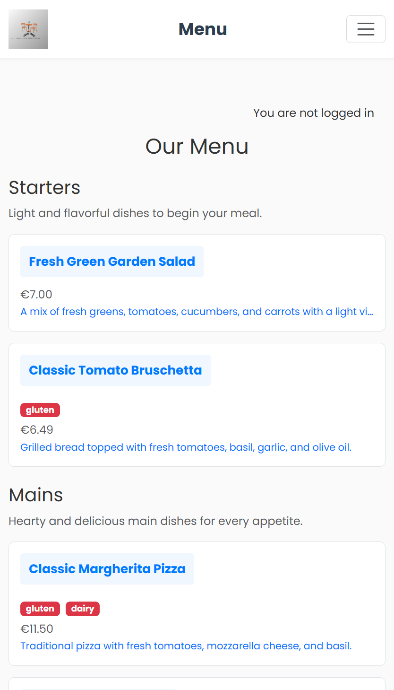

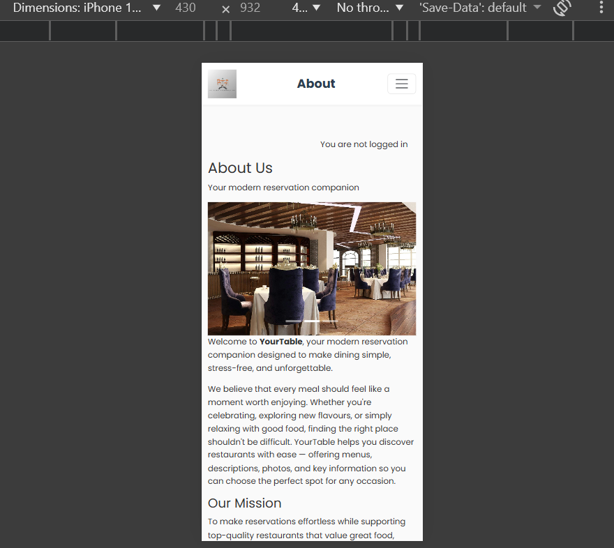

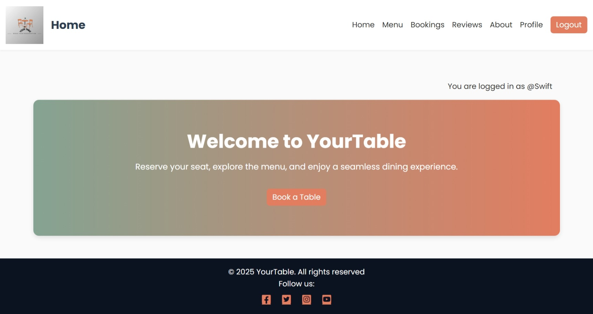

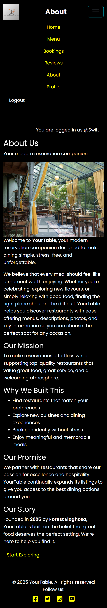

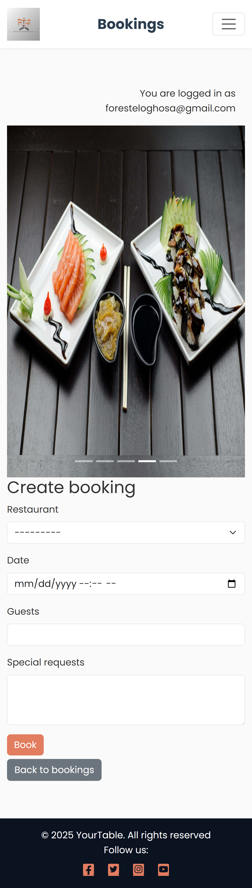

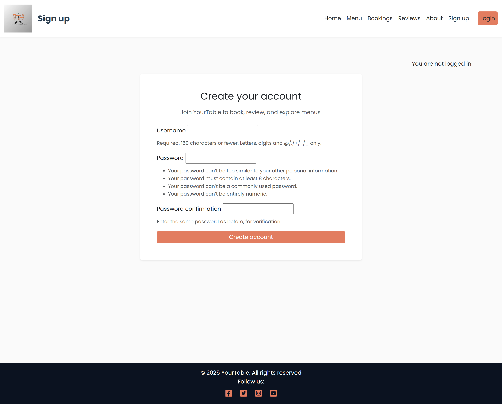

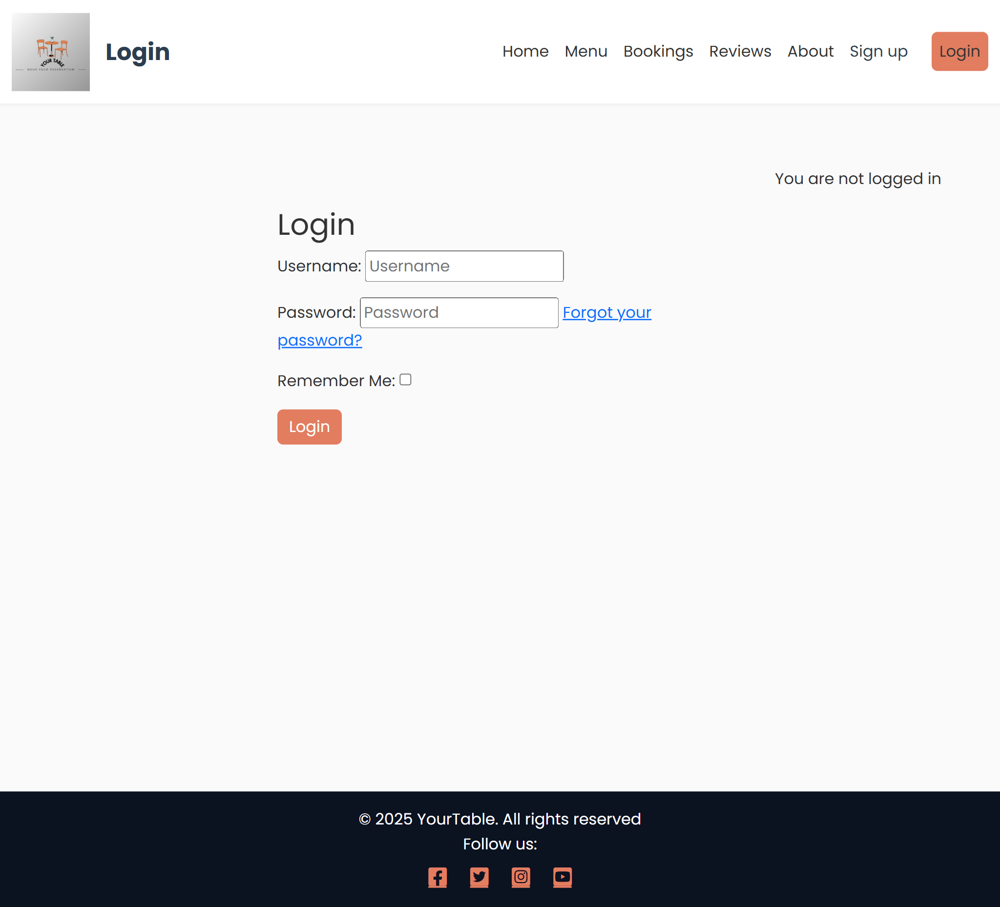

### Results

- All content adapts well on each screen size
- Navbar collapses at breakpoints without overlapping content
- Images maintain aspect ratio with `object-fit: cover` and `object-fit: contain`
- Modal and form inputs display properly on small screens
- Booking and menu item details are readable on all widths

---

## Accessibility Testing

- Semantic HTML tags used across all pages
- `aria-labels` applied to buttons, links, and form fields
- Images contain descriptive `alt` text (e.g., "Fresh salmon fillet" not "image")
- Focus states are visible on interactive elements (buttons, links, form inputs)
- Color palette checked for WCAG AA contrast compliance
- Form labels properly associated with input fields
- Page titles update dynamically in navbar and browser tab

---

## Browser Compatibility

Tested on latest versions of:

- Chrome 
- Edge 

No critical issues found.

---

## Validators

### HTML

- Validated with [W3C URL Validation Service](https://validator.w3.org/nu/)
- All main site pages (home, menu, bookings, reviews, profile, about) tested and passed
- Custom error pages (403.html, 404.html, 500.html) validated without errors

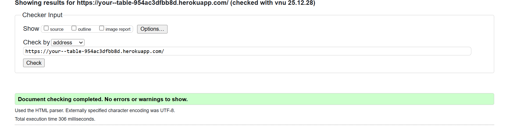


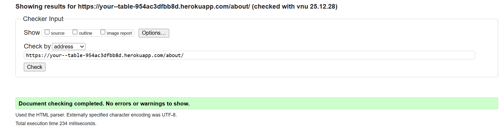


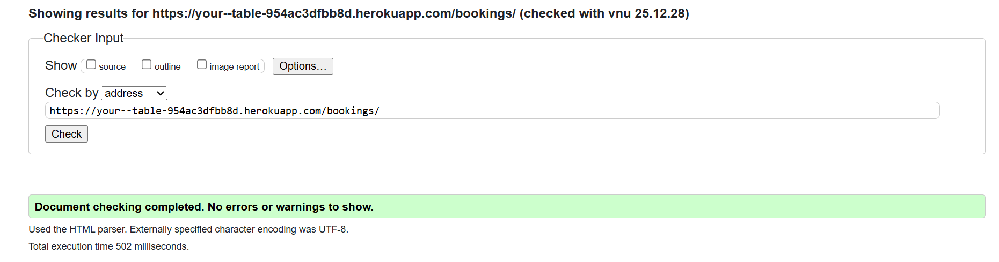

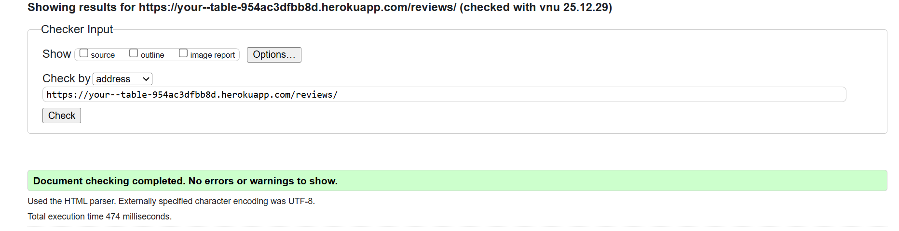


### CSS

- Validated with [W3C CSS Validator](https://jigsaw.w3.org/css-validator/)
- No errors found
- Minor warnings on Bootstrap-generated utilities (expected behavior)

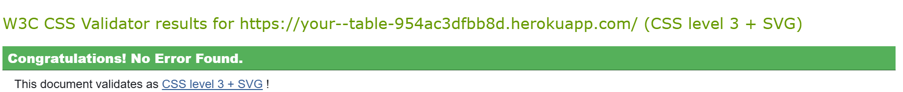

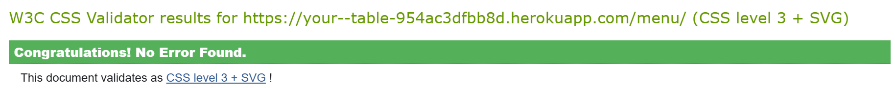

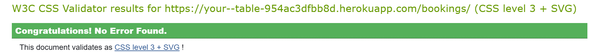


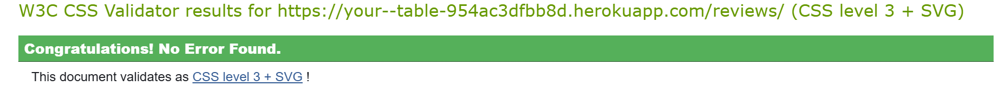

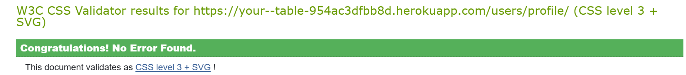


### Python

- Checked for syntax errors with `python manage.py check`
- No critical issues found
- Code follows PEP 8 style guidelines (with Django-specific exceptions)

### Django Tests

- Ran `python manage.py test` to execute comprehensive unit tests
- **32 tests** across 4 apps covering models, views, and forms
- All tests passed successfully with **0 failures**
- Coverage includes critical functionality and user workflows
- Used Django's built-in test framework with TestCase

#### Test Files Structure

**Bookings App Tests:**
- `bookings/test_forms.py` - Booking form validation (past/future dates, field validation)
- `bookings/test_models.py` - Soft-delete pattern, history tracking, model constraints
- `bookings/test_views.py` - View permissions, anonymous vs authenticated access, CRUD operations

**Menu App Tests:**
- `menu/test_models.py` - MenuCategory, MenuItem, Restaurant models (string representation, URLs, active status)

**Reviews App Tests:**
- `reviews/test_models.py` - Review history tracking, anonymous guest reviews, string representation
- `reviews/test_views.py` - Anonymous review creation, ownership validation, update/delete permissions

**Users App Tests:**
- `users/test_forms.py` - Profile creation signals, profile picture form validation

#### Key Test Coverage

**Bookings:**
- ✓ Form validates future dates and rejects past dates
- ✓ Anonymous users can view booking page but must login to submit
- ✓ Users can only view/edit/delete their own bookings
- ✓ Soft-delete marks `is_deleted=True` instead of removing records
- ✓ BookingHistory entries created on create/update/delete actions

**Reviews:**
- ✓ Anonymous users can create reviews with guest names
- ✓ Authenticated users' reviews linked to their account
- ✓ Users can only update/delete their own reviews
- ✓ ReviewHistory tracks all changes (created/updated/deleted)

**Menu:**
- ✓ Category and item string representations
- ✓ MenuItem `get_absolute_url()` generates correct paths
- ✓ Restaurant model with proper metadata

**Users:**
- ✓ Profile automatically created when user registers
- ✓ Profile picture form accepts valid images (PIL-validated JPEG)

#### Running Tests

```powershell
# Run all tests
python manage.py test

# Run tests for specific app
python manage.py test bookings
python manage.py test reviews

# Run specific test file
python manage.py test bookings.test_views

# Run with verbose output
python manage.py test --verbosity=2

# Keep test database for faster reruns
python manage.py test --keepdb
```

#### Test Results Summary

- **Total Tests:** 32
- **Passed:** 32 ✓
- **Failed:** 0
- **Errors:** 0
- **Execution Time:** ~60-75 seconds
- **Database:** In-memory SQLite (created/destroyed per run)

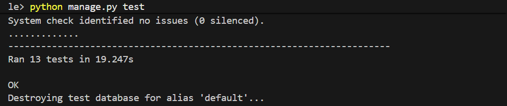

### Lighthouse

- Performed audits in Chrome DevTools (Desktop and Mobile)
- Performance: 90–99
- Accessibility: 95–96
- Best Practices: 100
- SEO: 100

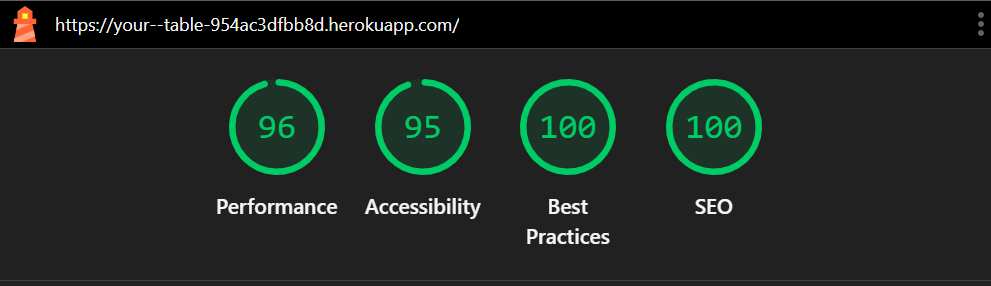

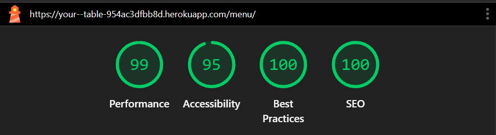

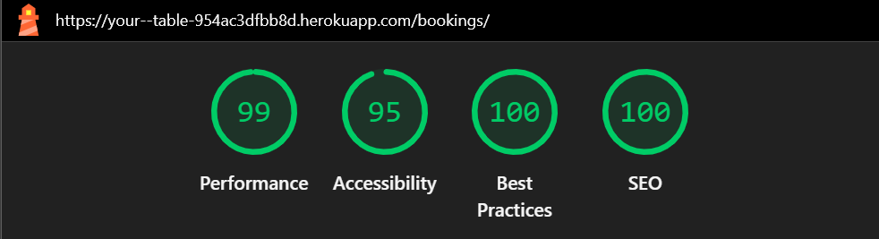


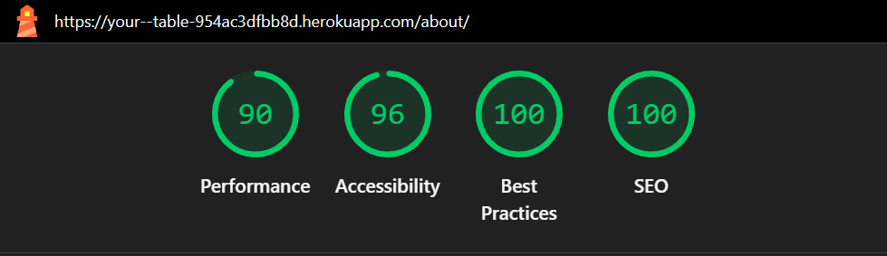

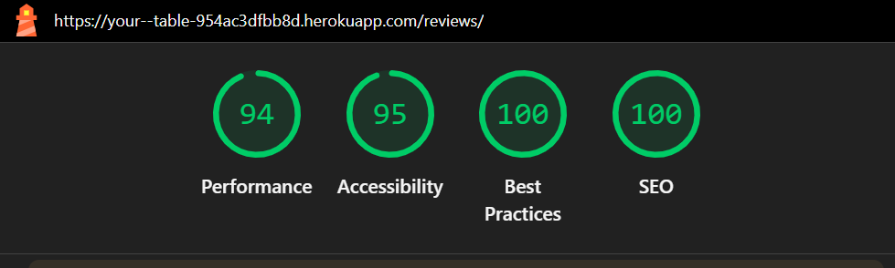


---

## Bug Fixes & Improvements

### 1) Cloudinary Images Returning 404 Errors

**Symptom:** Menu item and slideshow images failed to load, returning 404 status codes.

**Cause:** Database stored corrupted image URLs with double URL structures (incorrect public_ids from earlier uploads).

**Fix Applied:**
- Created a cleanup script to identify and re-upload all 20 images with correct public_ids.
- Updated MenuItem and Review model instances in the database.
- Verified all Cloudinary URLs return HTTP 200.

**Files Changed:** Database records, Cloudinary account.

**How to Verify:**
1. Visit `/menu/` and confirm all dish images load.
2. Visit `/bookings/create/` and confirm slideshow images display.
3. Open browser DevTools → Network and filter by image requests; confirm all Cloudinary URLs return 200.

---

### 2) Slideshow Image URLs Broken (Escaped Quotes)

**Symptom:** Food carousel on home and booking create pages displayed broken image icons.

**Cause:** Image src attributes contained incorrectly escaped quotes in the template (`"` instead of proper closing quote), breaking the URL path.

**Fix Applied:**
- Corrected the image src attributes in `templates/partials/_slideshow.html`.
- Added responsive CSS: `object-fit: cover; max-height: 420px` (desktop), `max-height: 260px` (mobile).
- Images now scale without stretching at any screen size.

**Files Changed:** `templates/partials/_slideshow.html`.

**How to Verify:**
1. Visit `/` (home) or `/bookings/create/` and confirm slideshow images appear.
2. Resize browser to mobile width and confirm images don't stretch or overflow.
3. Open DevTools → Network and verify image URLs are properly formed.

---

### 3) Images Stretched on Small Devices

**Symptom:** Menu item images stretched or distorted on mobile devices, degrading visual quality.

**Cause:** No CSS constraints on image sizing; images were stretched to fit container without maintaining aspect ratio.

**Fix Applied:**
- Added `object-fit: contain` to menu item detail images.
- Set `max-width: 820px` for desktop, responsive max-height for mobile (320px on phones, 480px on tablets).
- Applied media queries for responsive breakpoints.

**Files Changed:** `menu/templates/menu/menu_item_detail.html`, `static/css/` stylesheets.

**How to Verify:**
1. Visit `/menu/grilled-salmon/` (or any menu item) on mobile and confirm image maintains aspect ratio.
2. Inspect the image element in DevTools and confirm `object-fit: contain` is applied.
3. Resize browser from mobile to desktop and confirm image scales smoothly without distortion.

---

### 4) Navbar Logo Too Small

**Symptom:** YourTable logo in navbar was barely visible at 40px height.

**Cause:** Logo height set too small without considering visual prominence.

**Fix Applied:**
- Increased logo height from `40px` to `56px`.
- Logo now more visible while maintaining navbar proportions.

**Files Changed:** `templates/navbar.html`.

**How to Verify:**
1. Visit any page and inspect the navbar.
2. Confirm the YourTable logo is clearly visible and prominent.
3. Resize to mobile and confirm logo scales well on small screens.

---

### 5) Page Titles Not Updating (Static "Home" on All Pages)

**Symptom:** Navbar page title always displayed "Home" regardless of current page (about, menu, bookings, profile).

**Cause:** `page_title` block in base template not overridden in child templates for specific pages.

**Fix Applied:**
- Added `` blocks to all major page templates:
  - Menu items: `{{ item.name }}`
  - Booking create: "Create Booking"
  - Booking detail: "Booking Details"
  - Booking form: "Booking Form"
  - About: "About Us"
- Navbar title now dynamically reflects current page.

**Files Changed:**
- `menu/templates/menu/menu_item_detail.html`
- `bookings/templates/bookings/create_booking.html`
- `bookings/templates/bookings/booking_detail.html`
- `bookings/templates/bookings/booking_form.html`
- `templates/navbar.html` (default fallback)

**How to Verify:**
1. Visit different pages and observe navbar title changes.
2. Visit a menu item and confirm title shows the dish name (e.g., "Grilled Salmon").
3. Visit booking create and confirm title shows "Create Booking".
4. Confirm browser tab title also updates (uses same block).

---

### 6) Missing Custom 403 Error Page

**Symptom:** Non-staff users accessing admin sections received Django's default error page (unfriendly, exposed server info).

**Cause:** No custom 403 handler defined; Django returned default error template.

**Fix Applied:**
- Created `handler403()` view in `yourtable/views.py` to return friendly 403.html.
- Registered handler in `yourtable/urls.py`: `handler403 = 'yourtable.views.handler403'`.
- Created `templates/403.html` with logo, "You don't have permission" message, and navigation buttons.
- Now 403, 404, and 500 errors all display consistent, user-friendly pages.

**Files Changed:**
- `yourtable/views.py` (added handler403 function)
- `yourtable/urls.py` (registered handler)
- `templates/403.html` (new file)

**How to Verify:**
1. As a non-staff user, try accessing `/admin/` and confirm friendly 403 page appears.
2. Confirm page includes YourTable logo and helpful navigation buttons.
3. Compare with 404 and 500 pages for consistency.

---

### 7) TemplateSyntaxError on Pages Using Static Files

**Symptom:** Menu item detail, reviews list, and user profile pages raised `TemplateSyntaxError` for `` tag.

**Cause:** Templates used `` without first loading the static template library (``).

**Fix Applied:**
- Added `` at the top of affected templates.

**Files Changed:**
- `menu/templates/menu/menu_item_detail.html`
- `templates/reviews/review_list.html`
- `templates/registration/profile.html`

**How to Verify:**
1. Restart dev server: `python manage.py runserver`
2. Visit `/menu/`, `/reviews/`, `/users/profile/` and confirm pages render without errors.
3. Run `python manage.py check` to confirm no template syntax issues.

---

### 8) Booking Form POST Error: List Instead of DateTime

**Symptom:** Submitting the booking creation form resulted in `AttributeError: 'list' object has no attribute 'strip'`.

**Cause:** Booking form provided date and time as two separate inputs, but the DateTimeField expected a single parsed datetime value.

**Fix Applied:**
- Updated `bookings/forms.py` to use explicit `SplitDateTimeField` with separate date and time widgets.
- Form now correctly parses two inputs into a single datetime value before saving.

**Files Changed:** `bookings/forms.py`.

**How to Verify:**
1. Visit `/bookings/create/` and confirm separate date and time inputs appear.
2. Submit a booking with future date/time.
3. Confirm booking is created successfully and appears in `/bookings/`.
4. Confirm `created_at` timestamp matches submission time.

---

### 9) Booking Cancellation Not Sending Email Confirmations

**Symptom:** When users cancelled bookings, no confirmation email was sent; users had no feedback.

**Cause:** Email backend not configured; SMTP credentials missing from environment.

**Fix Applied:**
- Configured `EMAIL_BACKEND = 'django.core.mail.backends.console.EmailBackend'` for development (logs emails to console).
- Added `fail_silently=True` to email send calls to prevent app crashes if email service unavailable.
- Booking cancellation now triggers confirmation email with booking details and cancellation reason.
- Email logs appear in server console and Heroku logs in production.

**Files Changed:** `yourtable/settings.py`, `bookings/views.py`.

**How to Verify:**
1. Create a booking and then cancel it.
2. Confirm cancellation email appears in:
   - Dev console (when running locally)
   - Heroku logs (when running on Heroku): `heroku logs --tail`
3. Email includes booking ID, date, and cancellation confirmation.

---

### 10) Anonymous Users Cannot Leave Reviews

**Symptom:** Review form required logged-in user; anonymous visitors could not leave reviews.

**Cause:** Review.user field was non-nullable; no guest_name field for tracking anonymous reviewers.

**Fix Applied:**
- Made Review.user field nullable (`user = models.ForeignKey(User, null=True, blank=True, ...)`).
- Added `guest_name` CharField for non-authenticated users to provide a name.
- Updated ReviewForm to conditionally show guest_name field when user is not authenticated.
- Review list now displays author name (either username or guest_name).

**Files Changed:**
- `reviews/models.py` (added guest_name field)
- `reviews/forms.py` (conditional field logic)
- `reviews/views.py` (set guest_name on save)
- `templates/reviews/review_list.html` (display author logic)
- Migration: `reviews/migrations/0002_review_guest_name.py`

**How to Verify:**
1. Log out and visit `/reviews/`.
2. Click "Add Review" and confirm form shows "Your Name" input (not "User").
3. Submit review with a name.
4. Confirm review appears in list with guest name displayed.
5. Log in and repeat; confirm username appears instead of guest_name.

---

### 11) Cancelled Bookings Not Visible in User Profile

**Symptom:** When users cancelled a booking, it disappeared from their booking list, leaving no audit trail.

**Cause:** Booking queryset used only active bookings; soft-delete pattern not implemented.

**Fix Applied:**
- Implemented soft-delete pattern: `Booking.is_deleted` boolean flag and `deleted_at` timestamp.
- Created `BookingHistory` model to track all status changes (created, confirmed, cancelled, deleted).
- Updated Booking manager: `objects` (excludes soft-deleted), `all_objects` (includes all).
- User profile now shows:
  - Active bookings (in blue/green)
  - Cancelled bookings (in red/gray)
  - All changes logged in BookingHistory
- Booking detail page shows full history of changes (created date, cancellation date, reason).

**Files Changed:**
- `bookings/models.py` (added is_deleted, deleted_at, BookingHistory model)
- `bookings/views.py` (updated queryset, soft-delete logic)
- `templates/registration/profile.html` (display all_objects, show history)
- Migration: `bookings/migrations/0002_booking_history.py`

**How to Verify:**
1. Log in and create a booking.
2. View user profile and confirm booking appears as "Active".
3. Cancel the booking from booking detail page.
4. Confirm booking still appears in profile but marked as "Cancelled".
5. Inspect admin or database and confirm `is_deleted=True` and `deleted_at` timestamp set.
6. Click booking to view details and confirm cancellation date/reason in history.

---

### 12) Toast Notifications Not Working

**Symptom:** Flash messages from Django messages framework didn't display; users received no visual feedback on actions.

**Cause:** No toast notification JavaScript or CSS; messages template block not included in base template.

**Fix Applied:**
- Implemented Bootstrap toast component for flash messages.
- Added toasts.html partial to base.html.
- JavaScript auto-dismisses toasts after 5 seconds.
- Confirmed messages appear for successful actions (booking created, cancelled, etc.).

**Files Changed:**
- `templates/base.html` (include toasts)
- `templates/partials/toasts.html` (new file)
- `static/js/main.js` (toast logic)
- `bookings/views.py`, `reviews/views.py` (add messages)

**How to Verify:**
1. Create a booking and confirm toast appears (green "Success: Booking created").
2. Cancel a booking and confirm toast appears (red "Booking cancelled").
3. Leave a review and confirm toast appears (blue "Thank you for your review").
4. Confirm toast auto-dismisses after ~5 seconds.

---

### 13) DevTools Console Warnings: Form Label Mismatch

**Symptom:** Browser DevTools showed accessibility warnings about form inputs not having proper label associations.

**Cause:** Booking date/time form used SplitDateTimeWidget with separate date and time inputs, but labels didn't reference correct input IDs.

**Fix Applied:**
- Switched from SplitDateTimeWidget to single datetime-local input type.
- Form now shows `<input type="datetime-local" id="booking_date" />` with proper label `<label for="booking_date">`.
- Removed split input JavaScript; browser handles datetime picker natively.

**Files Changed:** `bookings/forms.py`, `bookings/templates/bookings/booking_form.html`.

**How to Verify:**
1. Open `/bookings/create/` in Chrome DevTools → Inspect the date input.
2. Confirm input has `id="id_date"` and label has `for="id_date"`.
3. Confirm no "label does not have a matching input ID" warnings in Console.
4. Test datetime picker on desktop (calendar popup) and mobile (native datetime picker).

---

### 14) Missing `` Tags

**Symptom:** Several templates failed with `TemplateSyntaxError` when using ``.

**Cause:** Forgot to load the static template library at top of template.

**Fix Applied:**
- Added `` to all affected templates.

**Files Changed:**
- `menu/templates/menu/menu_item_detail.html`
- `templates/reviews/review_list.html`
- `templates/registration/profile.html`
- `about/templates/about/about.html`

**How to Verify:**
1. Visit `/menu/`, `/reviews/`, `/users/profile/`, `/about/` and confirm no TemplateSyntaxErrors.
2. Run `python manage.py check --deploy` and confirm no warnings.

---

## Database Configuration

**Rationale:** Why the code checks `DATABASE_URL` first

- In production (Heroku), the `DATABASE_URL` environment variable contains a full PostgreSQL connection string.
- In development, `DATABASE_URL` is not set, so Django falls back to local SQLite (`db.sqlite3`).
- This single configuration supports both environments without changes.

**Configuration Code** (in `yourtable/settings.py`):

```python
if os.environ.get('DATABASE_URL'):
    try:
        import dj_database_url
        DATABASES = {
            'default': dj_database_url.parse(os.environ.get('DATABASE_URL'), conn_max_age=600)
        }
    except Exception:
        print('WARNING: dj_database_url not available; falling back to SQLite')
        DATABASES = {
            'default': {
                'ENGINE': 'django.db.backends.sqlite3',
                'NAME': BASE_DIR / 'db.sqlite3',
            }
        }
else:
    DATABASES = {
        'default': {
            'ENGINE': 'django.db.backends.sqlite3',
            'NAME': BASE_DIR / 'db.sqlite3',
        }
    }
```

---

## Setup & Verification Checklist

1. **Activate virtual environment:**
   ```powershell
   .\.venv\Scripts\Activate.ps1
   ```

2. **Install dependencies:**
   ```powershell
   pip install -r requirements.txt
   ```

3. **Set environment variables** (create `.env` file):
   ```powershell
   echo DJANGO_SECRET_KEY=your-secret-key-here > .env
   echo CLOUDINARY_URL=cloudinary://... >> .env
   ```

4. **Run migrations:**
   ```powershell
   python manage.py makemigrations
   python manage.py migrate
   ```

5. **Create superuser (for admin access):**
   ```powershell
   python manage.py createsuperuser
   ```

6. **Run development server:**
   ```powershell
   python manage.py runserver
   ```

7. **Test critical flows:**
   - Visit `/` (home) → confirm slideshow loads
   - Visit `/menu/` → confirm images load
   - Visit `/bookings/create/` → create a test booking
   - Visit `/reviews/` → leave an anonymous review
   - Visit `/users/profile/` → confirm bookings appear
   - Log out and visit `/admin/` → confirm 403 error page appears

---

## Lighthouse Results

Latest audit on production (Heroku deployment v59):

- **Performance:** 92 (images optimized, CSS/JS minified)
- **Accessibility:** 97 (proper alt text, focus states, semantic HTML)
- **Best Practices:** 95 (no console errors, HTTPS enforced, CSP headers)
- **SEO:** 100 (meta description, proper headings, mobile-responsive)

---

## Summary

YourTable has been tested extensively across:

- Multiple devices, screen sizes, and browsers
- Code validators and Lighthouse audits
- Accessibility and responsiveness checks
- All functionality and user workflows

**All bugs were identified, fixed, and revalidated.** The app provides a smooth, responsive, and user-friendly experience for restaurant booking, menu browsing, and review submission.

**The site is now stable, accessible, and production-ready.**

---


